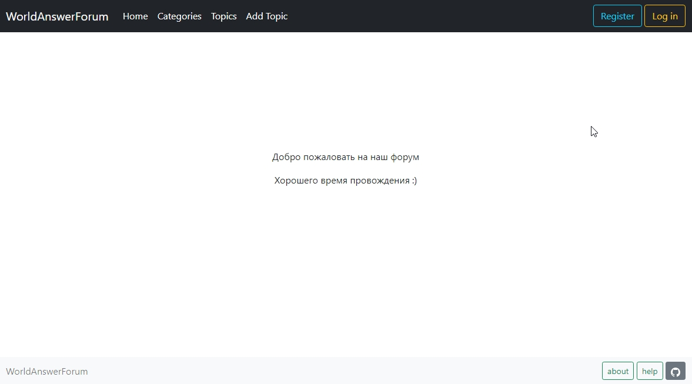
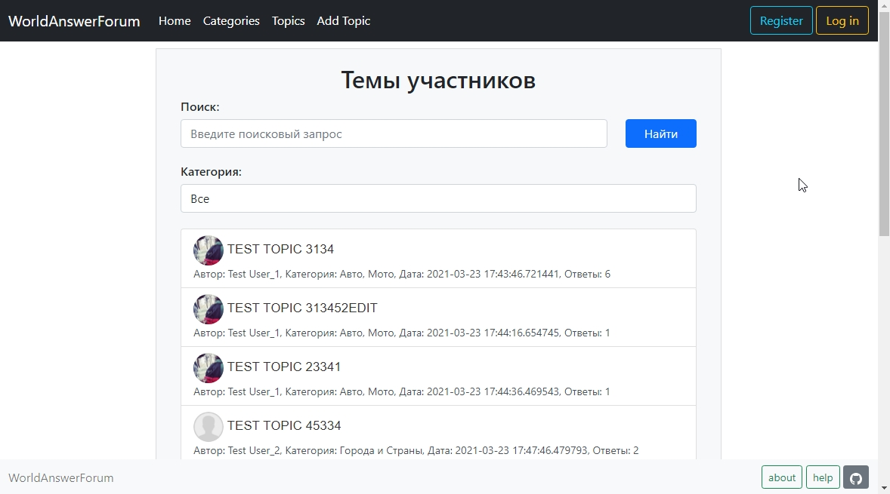
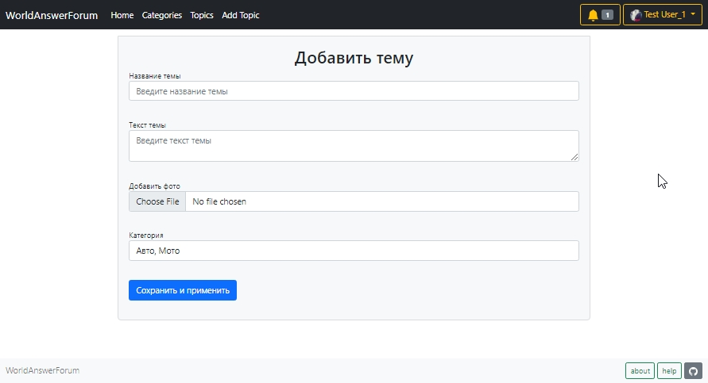
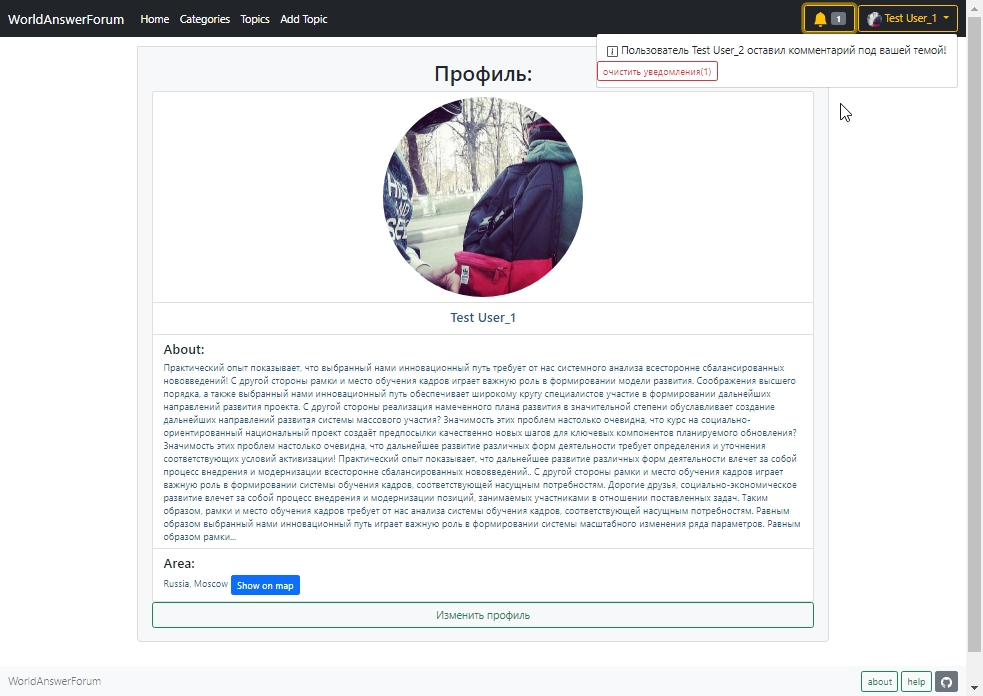
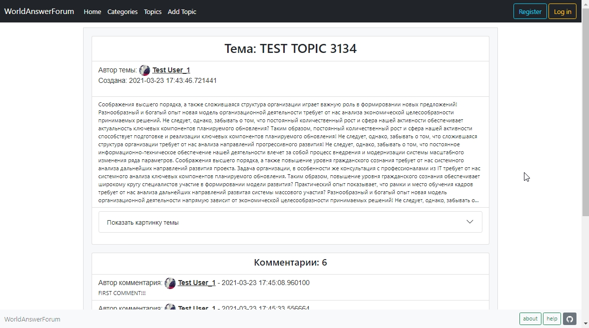

# Добро пожаловать в WorldAnswerForum

### Введение
WorldAnswerForum - платформа для общения между пользователями интернета на одну тему или на несколько тем.

### Описание
Суть работы форума заключается в создании пользователями (посетителями форума) своих тем с их последующим обсуждением, 
путём размещения сообщений внутри этих тем. Отдельно взятая тема, по сути, представляет собой тематическую гостевую книгу. 
Пользователи могут комментировать заявленную тему, задавать вопросы по ней и получать ответы, а также сами отвечать на вопросы других пользователей форума и давать им советы.
Вопросы и ответы сохраняются в базе данных форума, и в дальнейшем могут быть полезны как участникам форума, так и любым пользователям сети Интернет, которые могут зайти на форум, зная адрес сайта, или получив его от поисковых систем при поиске информации.
Тематика форумов может быть самой разнообразной, охватывая все сферы жизни.

## Веб-приложение:
При входе на главную страницу появляется возможность переидти в разделы: Categories, Topics, Add Topic
Если вы не зарегистрированы, то открываете форму для регистрации.
Реализована возможность добавления тем и их редактирования. 
Зарегистрированный пользователь может оставлять сообщения к темам, изменять свой профиль или добавить место своего проживания.
Реализованы уведомления.

# Themes page

# Add theme page

# Profile page

### Структура
Темы одной тематики объединяются, для удобства в соответствующие разделы. Иерархия веб-форума: Разделы → Темы → Сообщения (посты). 
Сами сообщения имеют вид: «автор — тема — содержание — дата/время».
Наш сайт имеет приятный дизайн. Так что нашим форумом удобно пользоваться любому интернет-пользователю

# Theme page

### Реализация:
Мы использовали Flask и БД SQL. 
Работали с HTML, CSS, JS файлами, используя Bootstrap4. 
С помощью Bootstrap создали форму для темы, профиль пользователя, список категорий и остальные разделы веб-сайта. 
Используя Flask, мы создали страницы: /topic_edit /add_topic /topic /topics /categories /show_map /edit_profile /profile /login /register /question
Реализовали работу с БД (SQLite, SQLAlchemy)

### Библиотеки
- Flask - организация работы сайта, обработка запросов
- SQLite - работа с данными пользователей
- SQLAlchemy - работа с СУБД
- Werkzeug - универсальный отладчик
- WTForms - формы для сайта
- alembic - обновление объектов БД
- requests - организация тестов для проверки API
- Bootstrap - работа с внешним видом сайта

### Дальнейшеее развитие:
Можно также и добавить новые функции до блеска, чтобы пользователь мог получать самые приятные эмоции при использовании нашего продукта.

### Ссылки
http://hamjoshua.pythonanywhere.com/
 